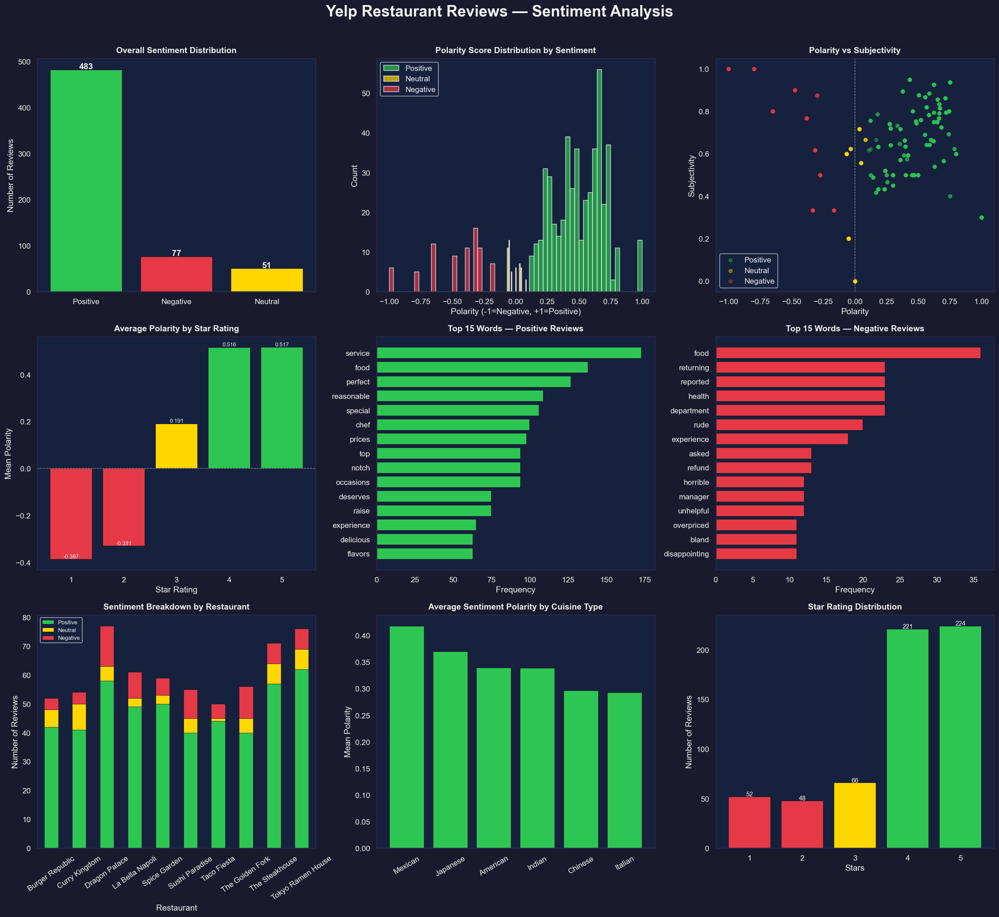

# 🍽️ Yelp Restaurant Reviews Sentiment Analysis

### CodeAlpha Data Analytics Internship – Task 4

This project performs sentiment analysis on Yelp restaurant reviews using Natural Language Processing (NLP) and data visualization techniques. The objective is to analyze customer opinions, identify sentiment patterns, and generate actionable insights through an interactive dashboard.


## 📌 Project Overview

Customer reviews are a valuable source of feedback for businesses. This project analyzes Yelp restaurant reviews and classifies them into Positive, Neutral, and Negative sentiments using sentiment analysis techniques.

The analysis explores customer satisfaction, sentiment intensity, restaurant performance, cuisine preferences, and review characteristics through a comprehensive dashboard.


## 🎯 Objectives

* Analyze customer sentiment from Yelp reviews.
* Classify reviews into Positive, Neutral, and Negative categories.
* Study sentiment distribution across restaurants.
* Explore the relationship between ratings and sentiment scores.
* Identify common words in positive and negative reviews.
* Compare customer sentiment across cuisine types.
* Generate actionable business insights using data visualization.


## 📊 Dataset Information

The dataset contains Yelp restaurant reviews along with ratings and restaurant-related information.

### Features Used

| Feature | Description |
|----------|-------------|
| Review Text | Customer review content |
| Star Rating | Rating given by customer (1–5) |
| Restaurant Name | Name of the restaurant |
| Cuisine Type | Restaurant cuisine category |
| Polarity Score | Sentiment polarity score |
| Subjectivity Score | Subjectivity measure |
| Sentiment | Positive, Neutral, or Negative |


## 📈 Analysis Performed

* Sentiment Classification
* Polarity Score Analysis
* Subjectivity Analysis
* Star Rating Analysis
* Restaurant-wise Sentiment Analysis
* Cuisine-wise Sentiment Analysis
* Positive Word Frequency Analysis
* Negative Word Frequency Analysis
* Dashboard Visualization


## 📊 Dashboard Visualizations

The generated dashboard (`yelp_sentiment_dashboard.png`) includes:

| Visualization | Purpose |
|--------------|---------|
| Overall Sentiment Distribution | Analyze sentiment proportions |
| Polarity Score Distribution by Sentiment | Study sentiment intensity |
| Polarity vs Subjectivity | Understand review characteristics |
| Average Polarity by Star Rating | Analyze rating-sentiment relationship |
| Top 15 Positive Words | Identify positive feedback trends |
| Top 15 Negative Words | Identify common complaints |
| Sentiment Breakdown by Restaurant | Compare restaurant performance |
| Average Sentiment Polarity by Cuisine Type | Cuisine comparison |
| Star Rating Distribution | Analyze customer rating patterns |


## 🔑 Key Findings

### 😊 Overall Sentiment

* Positive reviews dominated the dataset.
* Approximately 79% of reviews expressed positive sentiment.
* Negative and neutral reviews represented a smaller portion of customer feedback.

### ⭐ Rating vs Sentiment

* 4-star and 5-star reviews showed strong positive polarity.
* 1-star and 2-star reviews exhibited negative polarity.
* Sentiment scores closely aligned with customer ratings.

### 🍽️ Positive Feedback Trends

Most frequently used positive words included:

* service
* food
* perfect
* reasonable
* special
* chef
* delicious
* flavors

Customers highly appreciated food quality, service quality, and overall dining experience.

### 😞 Negative Feedback Trends

Most frequently used negative words included:

* rude
* refund
* horrible
* manager
* overpriced
* disappointing
* unhelpful

Negative reviews primarily focused on service-related issues and pricing concerns.

### 🏪 Restaurant Performance

* Most restaurants received predominantly positive reviews.
* Tokyo Ramen House and Dragon Palace showed strong positive customer sentiment.
* Some restaurants displayed higher proportions of negative reviews, indicating opportunities for improvement.

### 🌎 Cuisine Analysis

* Mexican cuisine achieved the highest average sentiment score.
* Japanese cuisine followed closely with highly positive customer feedback.
* Overall customer sentiment remained positive across all cuisine categories.


## 🛠 Technologies Used

* Python
* Pandas
* NumPy
* Matplotlib
* Seaborn
* TextBlob
* NLTK


## ⚙️ Installation

### Install Required Libraries

```bash
pip install pandas numpy matplotlib seaborn textblob nltk
```


## ▶️ How to Run

Execute the script:

```bash
python yelp_sentiment_analysis.py
```

The script will automatically:

1. Load the Yelp reviews dataset.
2. Perform sentiment analysis.
3. Calculate polarity and subjectivity scores.
4. Generate visualizations.
5. Create the sentiment dashboard.
6. Save the dashboard as `yelp_sentiment_dashboard.png`.


## 📁 Project Structure

```text
Yelp_Sentiment_Analysis/
│
├── yelp_sentiment_analysis.py
├── yelp_reviews.csv
├── yelp_sentiment_dashboard.png
└── README.md
```


## 🖼 Output

<h2>🍽️ Yelp Reviews Sentiment Dashboard</h2>

<p align="center">
  
</p>


## 🚀 Future Enhancements

* Implement machine learning-based sentiment classification.
* Develop interactive dashboards using Plotly and Streamlit.
* Perform aspect-based sentiment analysis.
* Build restaurant recommendation systems.
* Deploy the project as a web application.


## 👨‍💻 Author

**Sunil Pavan Raja**

Bachelor of Technology (Artificial Intelligence and Data Science)

Prathyusha Engineering College

GitHub: https://github.com/pavansunil75

E-mail id: pavansunil75@gmail.com


## 🙏 Acknowledgements

* CodeAlpha for providing the Data Analytics Internship opportunity.
* Yelp Dataset Community
* NLTK
* TextBlob
* Python Open Source Community
* Data Science Community


## 📄 License

This project is intended for educational and internship purposes.


⭐ If you found this project useful, consider giving it a star.
